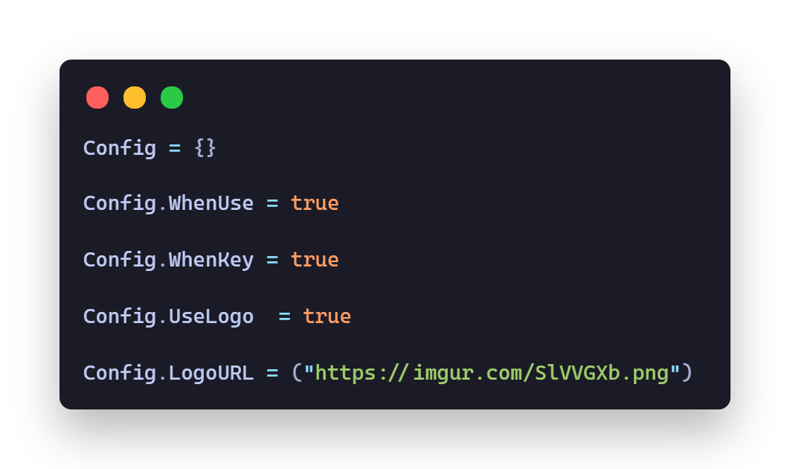

    

        <h3>Configurable UI</h3>
        

    

    

        <h3>Configs Preview</h3>
        

        
    

    

        <h3 style = "color:skyblue;font-weight:500">Credits  <@Jaareet#0097/></h3>
    

